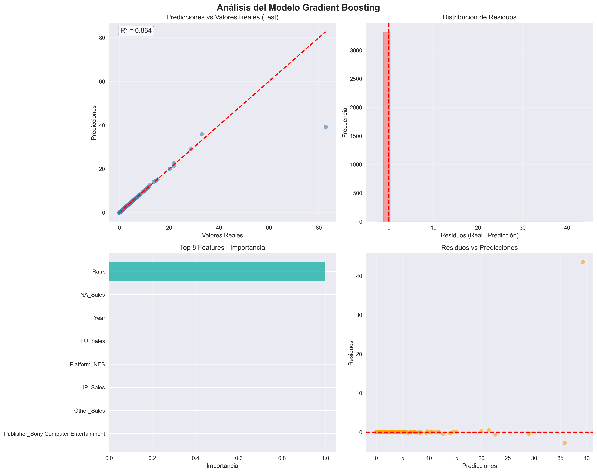

# Análisis Comparativo de Modelos de Regresión para Ventas de Videojuegos

## Descripción del Dataset

El proyecto utiliza el conjunto de datos **Video Game Sales** (vgsales_limpio.csv) proveniente de *Kaggle*, que contiene **16,598 registros** de videojuegos y **11 variables** por registro. Cada registro incluye información como *nombre*, *plataforma*, *año* de lanzamiento, *género*, *editor*, ventas regionales (Norteamérica, Europa, Japón y otras regiones) y las **ventas globales** (Global_Sales) del juego, que es la variable objetivo a predecir.  

En promedio, las ventas globales son de 0.54 millones de copias por juego, con valores que van desde títulos indie con **0.01** millones hasta superventas como *Wii Sports* con **82.74** millones. Este amplio rango y variedad de juegos ofrecen un escenario realista para entrenar y comparar distintos modelos de regresión

---

## Entrenamiento de los Modelos

### 1. Support Vector Machine
- Sin hiperparámetros adicionales.
- Punto de referencia simple pero interpretable.

### 2. Red Neuronal
- Dos capas ocultas de **128** y **64** neuronas.
- Activación: *ReLU*
- Optimizador: *Adam*
- Épocas: 1000

### 3. Gradient Boosting Regressor

- **n_estimators**=400
- **learning_rate**=0.05
- **max_depth**=3
- **subsample**=0.9

---

## Evaluación de Resultados

| Modelo                  | R² (test) | RMSE (millones) | MAE (millones) |
|-------------------------|-----------|-----------------|----------------|
| **SVM**    | 0.9986    | 0.0767           | 0.0759          |
| **Red Neuronal (MLP)**  | 0.9462    | 0.4754           | 0.0932          |
| **Gradient Boosting**   | 0.8638    | 0.7565           | 0.0178          |

---

## Visualizaciones

- **Predicciones vs Valores reales**: puntos cerca de la diagonal indican buen ajuste.
- **Distribución de residuos**: centrada en 0 indica que no hay sesgos.
- **Importancia de features**: las ventas regionales y características del juego son los features más influyentes.
- **Residuos vs Predicciones**: errores aleatorios indican buen aprendizaje.

---

## Análisis Comparativo

- **Support Vector Machine**  
  - *Ventajas*: simple, interpretable, rápido.  
  - *Desventajas*: no captura relaciones no lineales.  
  - *Resultado*: Mejor R² y errores más bajos, gracias a que las ventas globales son casi suma directa de las regionales.

- **Red Neuronal (MLP)**  
  - *Ventajas*: captura relaciones complejas y no lineales.  
  - *Desventajas*: requiere más datos, tiempo y ajuste fino.  
  - *Resultado*: Buen desempeño, pero no supera al modelo SVM en este caso.

- **Gradient Boosting**  
  - *Ventajas*: alta precisión en general, interpretabilidad parcial, robusto a overfitting.  
  - *Desventajas*: menor R² por casos atípicos, requiere ajustar hiperparámetros.  
  - *Resultado*: Buen rendimiento promedio, pero sensible a outliers.

---

## Conclusiones

En conclusión, este proyecto nos permitió comparar tres enfoques de regresión y reflexionar sobre sus diferencias en el contexto de Machine Learning y uso de modelos. El proceso nos mostró que no siempre el modelo más complejo es el más adecuado: aquí la solución **Support Vector Machine** resultó ser la de mejor desempeño global para predecir las ventas, ya que el patrón principal del conjunto de datos era principalmente lineal. Los modelos más avanzados, como la red neuronal y el Gradient Boosting, es verdad que son más poderosos supuestamente, pero no lograron ventajas muy significativas frente al modelo SVM en este caso específico.

Cada modelo tiene su propósito: **Support Vector Machine** se destaca por su sencillez y facilidad a la hora de interpretar cuando las relaciones son lineales, las redes neuronales nos aportan capacidad de generalización a patrones complejos y no lineales, siendo útiles cuando hay suficientes datos y relaciones intrincadas que capturar; los métodos de ensamble como Gradient Boosting ofrecen gran precisión en muchos escenarios de datos estructurados.

Finalmente, este ejercicio nos refuerza la importancia de ajustar el modelo al tipo de datos y al problema que estemos tratando. Un modelo bien ajustado no es el más duro de hacer, sino el que logra el mejor equilibrio entre sesgo y varianza para los datos disponibles. Aprendimos que entender la naturaleza de los datos es de vital importancia para elegir la técnica adecuada. En nuestro caso, la combinación de ventas regionales ya explicaba casi todo lo necesario, por lo que una solución simple fue suficiente y superior. En problemas futuros donde las relaciones no sean tan evidentes, seguramente modelos como el Gradient Boosting o las redes neuronales mostrarán su valor añadido. En resumen, el modelo más adecuado fue el que mejor se alineó con la estructura de los datos que en este proyecto fue el **Support Vector Machine**.
